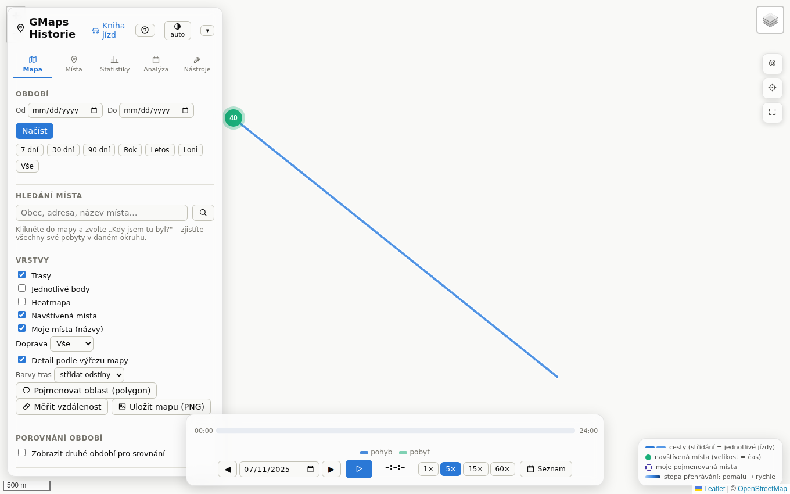
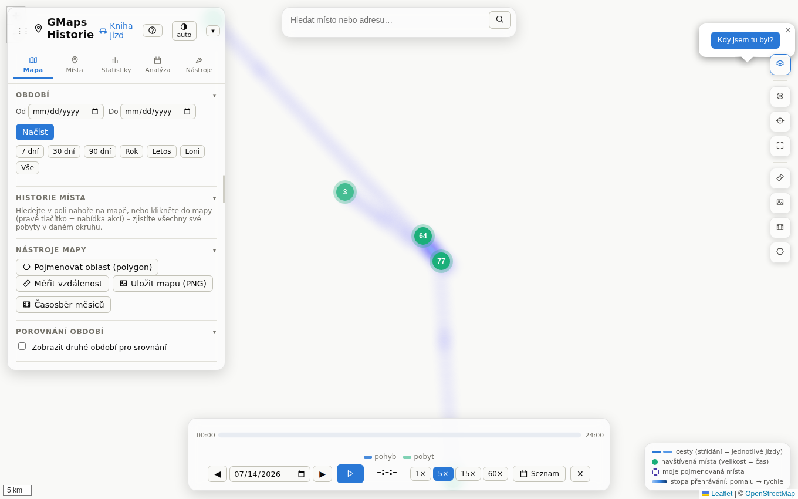
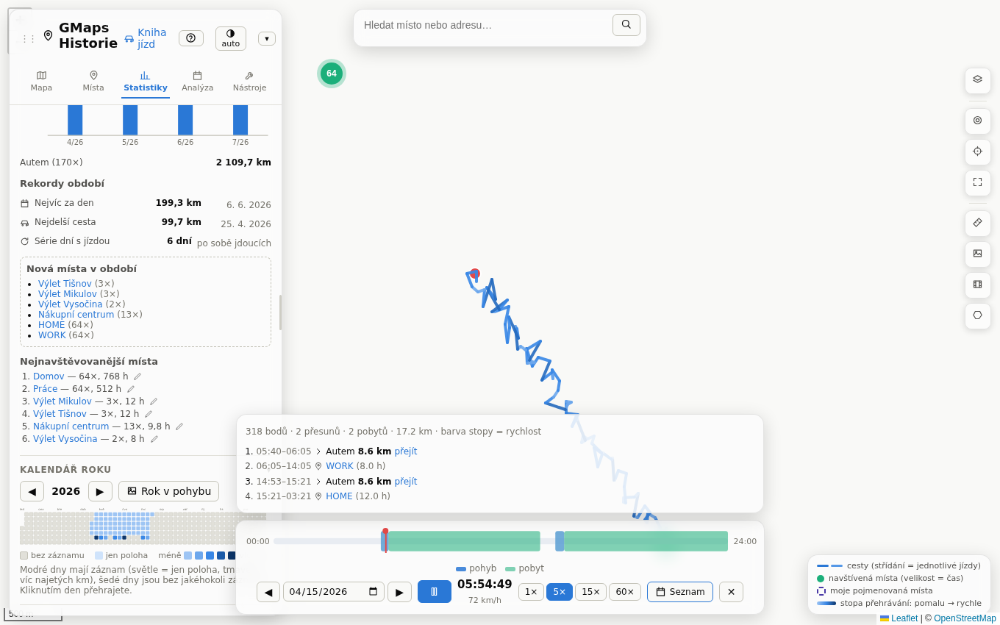
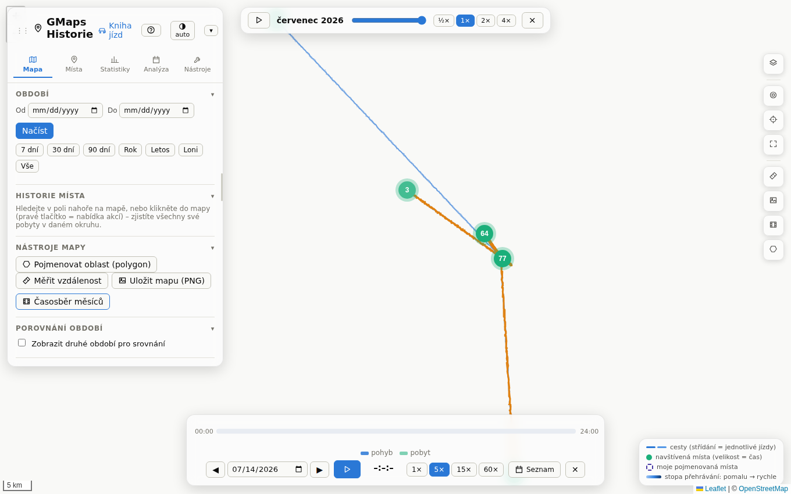
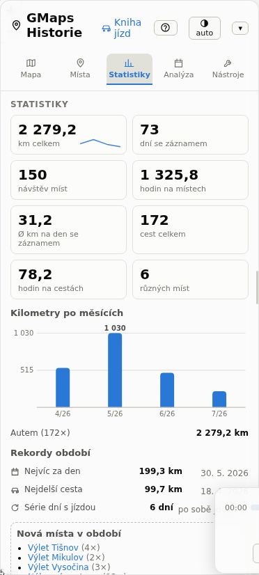
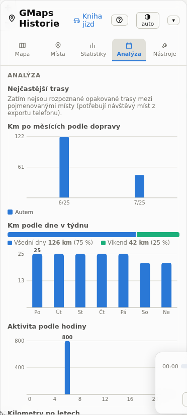
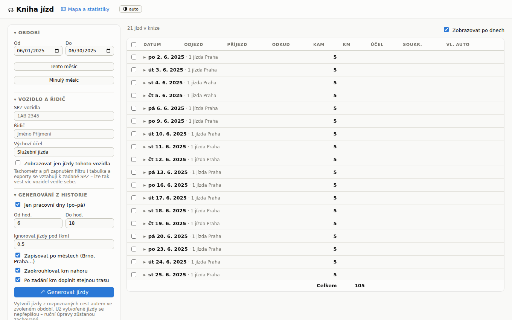
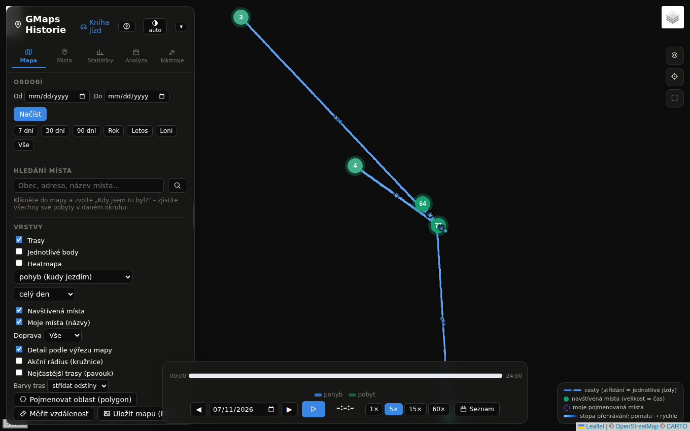

<div align="center">


# GMaps Historie

**Vaše historie polohy z Google Maps – zpátky na velké obrazovce, soukromě a bez cloudu.**

[](https://github.com/esrez/gmaps-historie-/actions/workflows/ci.yml)
[](LICENSE)
[](https://www.python.org)
[](#-rychlý-start)

</div>

Google zrušil webovou Časovou osu – historie polohy dnes žije jen ve vašem
telefonu. **GMaps Historie** vám ji vrátí: naimportujete export z Googlu
(Takeout i nový `Timeline.json`) a v prohlížeči máte interaktivní mapu všech
svých cest, heatmapu, statistiky, přehrávání dní i automatickou knihu jízd.

**Všechno běží u vás** – na domácím počítači, serveru nebo NASu. Poloha se
nikam neposílá, databáze je jeden SQLite soubor, který máte pod kontrolou.

> *English note: self-hosted viewer & analyzer for Google Maps location
> history (Takeout / Timeline.json). Czech-only UI for now.*

## ✨ Jak to vypadá

| Mapa všech cest | Heatmapa (kde trávím čas) |
|---|---|
|  |  |

| Přehrávání dne + časová osa | Časosběr měsíců |
|---|---|
|  |  |

| Statistiky s kalendářem roku | Analýza: rytmus týdne, top trasy |
|---|---|
|  |  |

| Kniha jízd | Tmavý režim |
|---|---|
|  |  |

*Screenshoty jsou z vestavěných ukázkových dat (průvodce → „Jen si to
vyzkoušet") – vyzkoušíte celou aplikaci bez vlastního exportu. Mapový podklad
se stahuje z internetu, v ukázce proto chybí.*

## 🗺️ Co všechno umí

### Mapa

- **Trasy, body i navštívená místa** s filtrem období (Letos / Loni / Vše…),
  4 mapové podklady (OSM, světlý/tmavý Carto, satelit) a tmavým režimem
- **Detail podle výřezu** – při přiblížení se automaticky dotáhne plný detail
  viditelné oblasti; **WebGL** zvládne plynule i statisíce bodů a **několik
  let historie najednou** (miliony bodů) se vykreslí během pár sekund
- **Heatmapa ve dvou režimech** – kudy jezdím × kde trávím čas, volitelně
  jen ráno / den / večer / noc
- **Přehrávání dne** – animace pohybu se stopou obarvenou rychlostí, časovou
  osou dne („odjezd → místo → přesun") a listováním po dnech; volitelné
  **přichycení stopy k silnicím** (OSRM, opt-in)
- **Časosběr měsíců** – celá historie jako animace měsíc po měsíci
- **Barvení tras podle roku**, porovnání dvou období přes sebe, akční rádius
  a „pavouk" nejčastějších tras přímo na mapě
- **„Kdy jsem tu byl?"** – klik kamkoli do mapy vypíše všechny vaše pobyty
  v okolí; hledání navštívených míst i libovolné adresy
- **Vlastní místa** – pojmenujte si zákazníky a areály (kruh či obkreslený
  polygon, interaktivní úprava tvaru), s adresami a našeptávačem
- **Měření vzdálenosti** a **export výřezu mapy do PNG**

### Statistiky a analýza

- Dlaždice s **trendem oproti minulému období**: km, dny, návštěvy, hodiny
  na cestách i na místech, počty cest a míst
- **Kalendář roku** obarvený podle najetých km – najetí ukáže detail dne,
  klik ho přehraje; sdílitelná PNG karta **„Rok v pohybu"**
- **Rekordy** (nejvíc km za den, nejdelší cesta, série dní), nová místa,
  top místa s možností přejmenování
- **Zajímavosti**: akční rádius (50/90/99 % záznamů), nejdál od domova,
  noci mimo domov, typický začátek/konec dne, **rytmus týdne** (punchcard)
- Kilometry podle dopravy, dne v týdnu, hodiny dne a let

### Kniha jízd

- **Automatické generování** z rozpoznaných cest autem (volitelně jen
  pracovní dny/doba), odkud/kam podle vašich míst, zápis po městech
- Plně editovatelná tabulka po dnech, **pravidla kilometrů** (Kancelář =
  12 km se doplní všem jízdám na trase), tachometr, více vozidel dle SPZ
- **Exporty**: XLSX (vč. formátu pro program SPZ), CSV, **PDF pro tisk**;
  roční souhrn a uzávěrka měsíce; vícekrokové zpět

### Data pod kontrolou

- **Import všech formátů Googlu** s autodetekcí: nový `Timeline.json`
  (Android i iPhone), starý Takeout (`Records.json` i vícegigabajtový,
  `Semantic Location History`), nebo rovnou celý ZIP – s přehledem, co se
  naimportovalo a co přeskočilo a proč; duplicity se přeskakují
- **Kontrola kvality** s návrhy oprav (GPS teleporty, nepřesné body, vadné
  návštěvy) – nic se nemaže bez potvrzení
- **Automatické denní zálohy** s obnovou jedním klikem, profily (více
  uživatelů/období vedle sebe), smazání zvoleného období (soukromí)
- **Exporty ven**: XLSX, **GPX** (po cestách) a **GeoJSON** (trasy jako
  LineString, volitelná anonymizace souřadnic)
- **Průběžná synchronizace** (volitelná): OwnTracks / GPX upload endpointy

### Soukromí především

- Poloha **neopouští váš stroj**; jediné výjimky jsou mapové dlaždice
  (lze nahradit **plně offline** podkladem PMTiles) a volitelné, výchozím
  stavem vypnuté zjišťování adres a přichycení k silnicím
- Volitelné heslo (`AUTH_PASSWORD`) s brzdou proti hádání, secure cookies
  za HTTPS proxy, žádná telemetrie

## 🚀 Rychlý start

### Windows (portable, bez instalace)

Stáhněte **`GMapsHistorie.exe` z [Releases](https://github.com/esrez/gmaps-historie-/releases)**
a spusťte – žádná instalace, žádná admin práva. Aplikace běží jako ikona
v systémové liště a sama otevře prohlížeč. Data zůstávají
v `%LOCALAPPDATA%\GMapsHistorie`, takže aktualizace = prosté nahrazení exe
novějším (aplikace na nové vydání sama nenápadně upozorní). Autostart,
přístup z telefonu a další tipy: [docs/WINDOWS.md](docs/WINDOWS.md)
a [návod](docs/NAVOD.md#8-windows-11-tipy).

<details>
<summary>Alternativa: spuštění ze zdrojáků (Python 3.11+)</summary>

1. Nainstalujte [Python 3.11+](https://www.python.org/downloads/)
   (zaškrtněte *Add python.exe to PATH*).
2. Stáhněte projekt (*Code → Download ZIP*) a rozbalte.
3. Dvojklik na **`start-windows.bat`** – závislosti se nainstalují samy
   a otevře se prohlížeč.
</details>

### Docker (domácí server / NAS)

```bash
git clone https://github.com/esrez/gmaps-historie-.git
cd gmaps-historie-
docker compose up -d --build
```

Aplikace poběží na `http://server:8000`, databáze v `./data/history.db`.

### Linux / macOS (Python)

```bash
pip install -r requirements.txt
python run.py     # nastartuje server a otevře prohlížeč
```

**První kroky:** při prázdné databázi se otevře průvodce – ukáže, kde vzít
data z Googlu, a tlačítkem **„Jen si to vyzkoušet"** nahraje ukázková data,
ať vidíte všechno hned. Pak stačí nahrát vlastní export (JSON či celý ZIP).

## 📦 Jak získat data z Googlu

| Zdroj | Soubor | Kde |
|---|---|---|
| Telefon (Android) | `Timeline.json` | Nastavení → Poloha → Časová osa → Exportovat |
| Telefon (iPhone) | `Timeline.json` | Google Maps → profil → Vaše časová osa → ⋯ → Nastavení |
| Starý Takeout | `Records.json`, `Semantic Location History/…` nebo celý `.zip` | [takeout.google.com](https://takeout.google.com) |

Import je idempotentní (opakované nahrání nic nezdvojí) a i vícegigabajtové
soubory se zpracují na pozadí se streamovaným čtením.

## ⚙️ Nastavení

| Proměnná | Význam | Výchozí |
|---|---|---|
| `HOST` | `0.0.0.0` = dostupné v domácí síti | `127.0.0.1` |
| `PORT` | port | `8000` |
| `DB_PATH` | umístění databáze | `data/history.db` |
| `TZ` | časové pásmo (řeší letní čas) | `Europe/Prague` |
| `AUTH_PASSWORD` | zapne přihlášení heslem | – |
| `UPDATE_CHECK_URL` | prázdné = vypnout kontrolu nových verzí | GitHub releases |
| `OPEN_BROWSER` | `0` = neotvírat prohlížeč (run.py) | `1` |

Vystavujete-li aplikaci do internetu, dejte před ni reverse proxy s HTTPS
(Caddy, nginx, Tailscale…) a nastavte `AUTH_PASSWORD` – jde o citlivá data.

## 📚 Dokumentace

- **[Uživatelský návod](docs/NAVOD.md)** – všechny funkce krok za krokem,
  Windows 11 tipy, řešení potíží
- **[API reference](docs/API.md)** – všechny endpointy; interaktivně na
  `http://server:8000/api/docs` (Swagger UI)
- **[Windows portable aplikace](docs/WINDOWS.md)** – použití, autostart,
  build `.exe`, vydávání přes GitHub Releases
- **[CHANGELOG](CHANGELOG.md)** – co je nového

## 🏗️ Architektura

| Vrstva | Technologie |
|---|---|
| Backend | Python 3.11+, FastAPI (routery v `app/routers/`, služby v `app/services/`), SQLite WAL |
| Import | autodetekce formátu, streamované čtení přes `ijson`, běh na pozadí, SSE notifikace |
| Frontend | vanilla ES moduly (`app.js` + `places-ui.js`, `map-tools.js`, `timelapse.js`…), Leaflet, PWA |
| Zobrazování | data podle výřezu mapy s rušením rozpracovaných dotazů, Douglas–Peucker simplifikace, gzip |
| Kvalita | pytest (91 testů) + ruff + ESLint + 28 e2e testů (Playwright) v GitHub Actions |
| Nasazení | Docker / docker-compose, portable PyInstaller `.exe` (GitHub Releases), in-place updater |

Žádný build frontendu, žádný framework – repozitář naklonujete a ono to běží.

## 🛠️ Vývoj

```bash
pip install -r requirements.txt pytest httpx ruff
ruff check app/ tests/    # lint backendu
pytest -q                 # testy backendu
npm ci && npm run lint    # ESLint frontendu
npx playwright test       # e2e testy (celé UI proti demo datům)
uvicorn app.main:app --reload
```

Screenshoty do README se generují skriptem `scripts/make_screenshots.mjs`
(nejlépe na stroji s internetem, ať mají mapový podklad).

Náměty a chyby vítány v [Issues](https://github.com/esrez/gmaps-historie-/issues).
Před pull requestem prosím spusťte testy a linty (CI je kontroluje také).

## 📄 Licence

[MIT](LICENSE) – používejte, upravujte a šiřte svobodně.
Mapové podklady © přispěvatelé [OpenStreetMap](https://www.openstreetmap.org/copyright),
[CARTO](https://carto.com/attributions), Esri; geokódování
[Nominatim](https://nominatim.org), trasy [OSRM](https://project-osrm.org),
offline mapy [Protomaps](https://protomaps.com).
